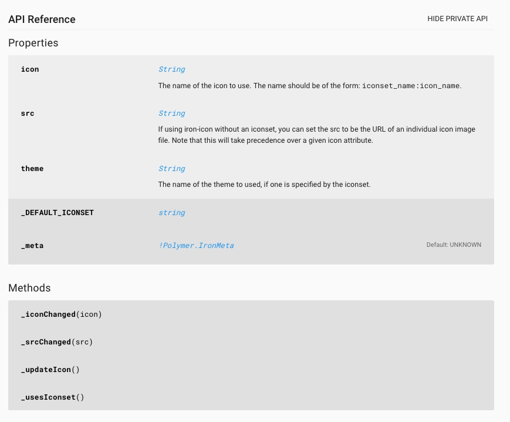

# POLYMER STYLE GUIDE

This is a compilation of rules and style guides to use when developing Polymer components.

<a name="contents"></a>
## Table of Contents

  1. [Introduction](#introduction)
  1. [Properties](#properties)
  1. [Functions](#functions)
  1. [Observers](#observers)
  1. [Events](#events)
  1. ["this" Context](#this)
  1. [Swich statements](#swich)
  1. [Comments](#comments)
  1. [Documentation](#documentation)
  1. [Code Layout](#layout)
  1. [TODOs](#todos)
  1. [Resources](#resources)
  1. [Conclusion](#conclusion)
  1. [Contribute](#contribute)


<a name="introduction"></a>
## Introduction
> Polymer is a lightweight library that helps you take full advantage of Web Components.

> With Web Components, you can create reusable custom elements that interoperate seamlessly with the browser’s built-in elements, or break your app up into right-sized components, making your code cleaner and less expensive to maintain.

> https://www.polymer-project.org

Polymer is an Open Source front-end library developed by Google. It aims to be a wrapper to the Web Components standard that was introduced within HTML 5.
Polymer reinforces the idea proposed by Google of developing **Progressive Web Applications**, which i am pretty convinced that is the future in web development.

As mentioned before, Polymer is based on Web Components, this enables modular, flexible and reusable web development. All this is possible because each component exposes its own API, which will be used by other components and keep all components communicated. Here is where 2 types of API arise.
<a name="pubapi"></a>

#### Public API

The public API contains all [properties](#properties) and [functions](#functions) that can be consumed from the outside of the component. This means that public properties can show the state content of the component, and public functions allow communication between components.

<a name="privapi"></a>
#### Private API

Here you can find all properties that are used internally inside the component and don´t give any extra information to the outside components. Also sometimes, there are some private functions that are required for internal processing, but they are not useful to be used from another component.

All this, is important to be considered in the [documentation](#documentation) process and can be seen as example in the [Polymer Elements Catalog](https://elements.polymer-project.org/elements).



<a name="properties"></a>
## Properties

All properties defined inside a Polymer component consisting of more than one word are always written using *lowerCamelCase*

```javascript
// for example setting a user´s name
const userName = "Polymer"
```
All properties are exposed from the component to its API, but sometimes there is variables that are internally handled and
are not considered part of the component's [public API](#pubapi) but of the [private API](#privapi). This properties should be proceeded by a `_`, and by convention should be
located at the end of the properties list.

When defining properties inside a component, every variable should be initialized with a default value:

```javascript
Polymer({

  is: 'x-custom',

  properties: {

    name: {
      type: String,
      value: 'xxx'
    },
    age: {
      type: Number,
      value: -1
    },
    isAlive: {
      type: Boolean,
      value: true
    },
    data: {
      type: Object,
      notify: true,
      value: function() { return {}; }
    },
    wishList: {
      type: Array,
      notify: true,
      value: function() { return []; }
    },
    _privateProperty: {
      type: number,
      value: 0
    },
  }

});
```
**[⬆ back to top](#contents)**
<a name="functions"></a>
## Functions

All functions defined inside a component, whose names consist of more than one word are always written using *lowerCamelCase*.

In this matter, following the [Clean Code](http://blog.cleancoder.com/) guidelines, functions, are defined considering the ***"Do one thing"*** and ***"Don´t repeat yourself"*** principles.

Since, in most cases, functions inside a polymer component are changing it´s properties, they should have the smallest number of arguments. It means that the mayority of custom functions will be **niladic** and will mutate the component inside them.

When defining custom/helper functions, the definition should be as representative as possible, regardless of the name´s length.

Note that from all functions that a Polymer component exposes as API, there is a [public API](#pubapi) and a [private API](#privapi) . Sometimes there are internal functions to handle specific tasks which are not relevant in the use of the component. Therefore, this functions are considered part of the component's private API and are proceeded by a `_`(similar to [private properties](#properties) )

```javascript
...
scrollToBottom: function() {
    ...
},
...
checkCollapsibleTime: function(timestamp, timestampnext) {
    ...
},
...
_internalUsefullFunction: function() {
    ...
}
...
```
This functions. should not be defined with the **prefixes** or **suffixes** used in Observers and Listeners. In this way, custom functions and system functions will be easier to distinguish.

**[⬆ back to top](#contents)**

<a name="observers"></a>
## Observers

In order to make Obverser callback functions as distinguishable as possible, the prefix `_` (observer functions belong to the component's [private API](#privapi) ) and other suffixes are used according to their purpose. In most cases `xxx` will be the target variable which will update.

### Simple and complex Observers
Use of expression `_xxxChanged`

#### Example (simple)
```javascript
Polymer({

  is: 'x-custom',

  properties: {
    myVariable: {
      type: Boolean,
      observer: '_myVariableChanged'
    }
  },

  _myVariableChanged: function(newValue, oldValue) {
    ...
  }

});
```
#### Example (complex)
```javascript
Polymer({

  is: 'x-custom',

  properties: {
    myUsers: {
      type: Array
    }
  },
  observers: [
    '_myUsersChanged(users.*)'
  ],
  _myUsersChanged: function(newValue, oldValue) {
    ...
  }

});
```
### Multiple properties
Use of expression `_updatexxx`
#### Example
```javascript
Polymer({

  is: 'x-custom',

  properties: {
    preload: Boolean,
    src: String,
    size: String
  },

  observers: [
    '_updateImage(preload, src, size)'
  ],

  _updateImage: function(preload, src, size) {
    // ... do work using dependent values
  }

});
```
### Array mutations
Use of expression `_xxxAdedOrRemoved`
#### Example
```javascript
Polymer({

  is: 'x-custom',

  properties: {
    myUsers: {
      type: Array
    }
  },
  observers: [
    '_usersAddedOrRemoved(users.splices)'
  ],
  _myUsersCusersAddedOrRemovedhanged: function(changeRecord) {
    ...
  }

});
```
**[⬆ back to top](#contents)**

<a name="events"></a>
## Events
Due to the double way data-binding, to the event listener and to the event firing system, handling events becomes very handy. This a very powerfull way to communicate between componnents. Note, that Behaviors can also generate events (exposed functions that get called under speciffic conditions and are overriden) so their functions are defined the same way as system events.

### Listeners
Again, as considered with the [observers](#observers), listener methods belong to the component's [private API](#privapi), therefore they are proceeded by `_`. Other than that, there is no need of a speciffic preffix when defining event listeners, but again, they should be as representative as possible. The `handle` preffix is considdered to be very appropiate for this use.

#### Example
```html
<dom-module id="x-custom">
  <template>
    <button on-tap="_handleTap" onclick="_handleClick">Kick Me</button>
  </template>
  <script>
    Polymer({
      is: 'x-custom',
      listeners: {
        'click': 'handleClick',
      },
      _handleTap: function() {
        alert('tapped!');
      },
      _handleClick: function() {
        alert('clicked!');
      }
    });
  </script>
</dom-module>
```

### Fire events
It is very usefull to comunicate with other components by firing custom events. The event´s name should be as short as possible and always taking into account that the parent´s function handling your event will be called under the property `on-eventname`.

#### Example

```html
 <!-- parent component -->
<dom-module id="x-custom">
  <template>
    ...
  </template>

  <script>
    Polymer({

      is: 'x-custom',
        ...
      loadMenssages: function() {
        ...
        this.fire('items-loaded', {items: this.chatItems});
      }

    });

  </script>

</dom-module>

<!-- child  component -->
<dom-module id="x-custom">
  <template>
    ...
    <parent-component on-items-loaded="handleItemsLoaded">

    </parent-component>
  </template>

  <script>
    Polymer({

      is: 'x-custom',
        ...
      handleItemsLoaded: function(items) {
        ...
      },


    });

  </script>

</dom-module>

```

**[⬆ back to top](#contents)**

<a name="this"></a>
## "this" Context

Usually, the `this` variable can be called multiple times inside a function. Whenever a function changes context, like in `Promises` or JavaScript's own functions, the `bind` function will be used to pass the `this` variable and keep context.

### Example
  ```javascript
  const referenceValue = ...
  ...
    // in JavaScript's own function
    myList.forEach(function(listValue){
      // do your work for each value
      if (listValue === this.referenceValue) {
        console.log("eureka");
      }
    }.bind(this));

  ...
    // in Promise
    this.findValue({
      // your params
    }).then(function(foundValue){
      // do your work with value
      if (foundValue === this.referenceValue) {
        console.log("eureka");
      }
    }.bind(this));
  ```
**[⬆ back to top](#contents)**

<a name="swich"></a>
## Swich statements

As mentioned before in the [functions](#function) section, it is desirable to make functions ***do one thing***. However, any function containing a *swich statement*  will not satisfy this principle. This is why, the best approach on this matter, is to make every *swich case* to call another function and delegate the code load in more speciffic functions.

Later, it's important to consider that whenever one of this functions is placed complying the [code layout](#layout) *hierarchy*, the speciffic functions called inside the *swich cases* should be placed below that function, in order to make code more readable.

**[⬆ back to top](#contents)**

<a name="comments"></a>
## Comments

Comments and their use are very well defined in the next quotes found in [Clean Code book](http://blog.cleancoder.com/):
> Clear and expressive code with few comments is far superior to cluttered and complex code with lots of comments.

> [...]

> Truth can only be found in one place: the code. Only the code can truly tell you what it does. It is the only source of truly accurate information. Therefore, though comments are sometimes necessary, we will expend significant energy to minimize them.

This is the most appropiate approach that should be taken while coding polymer components.

**[⬆ back to top](#contents)**

<a name="documentation"></a>
## Documentation

Even if having a legible code is important, in huge projects where various programmers are touching the same code or programmers have to reuse components wich are not made by them (reusable components is one of polymer's main purposes) documentation is something to take care of.
Documentation is allways painfull and a *plus* of work that programmers usually don´t like but it is deffinetly a *minus* of work for the next programmer that wants to reuse that component.

In this purpose, there is a very simple guide about documentation in the [Polymer `<style-guide>`](https://polymerelements.github.io/style-guide).

Next step is to use [iron-doc-viewer](https://elements.polymer-project.org/elements/iron-doc-viewer) component to generate each component's API.

### Example
```JavaScript
/**
 * Represents a book.
 * @constructor
 * @param {string} title - The title of the book.
 * @param {string} author - The author of the book.
 */
function Book(title, author) {
}
```

**[⬆ back to top](#contents)**

<a name="layout"></a>
## Code layout

Finally, while coding and writing Polymer components in a relatively big project, i thought that it was important to have a certain order or arrangement in order to have a readable and mantainable code ( which is every developer´s dream).

In this purpose, the idea is to have a *"hierarchy"* taking into account all the items mentioned above.

Here will be represented the layout proposed by the next diagrams.


### Component Generic Layout
```
- definition
|
- properties
|
- behaviors
- observers
- listeners
|
- variables
|
- functions
```

### Component Expanded Layout
```
- definition
|
- properties
  |
  - order can be decided according to property´s relevance
|
- behaviors
- observers
  |
  - order can be defined the same as the "observed's" property order
|
- listeners
|
- variables
  |
  - behavior defined variables
  - custom variables
|
- functions
  |
  - component lifecycle functions
  - behavior defined functions
  - observer functions
  - listener functions
  - computed variables functions
  - functions fired by other components' events
  - custom functions
```

**[⬆ back to top](#contents)**

<a name="todos"></a>
## TODOs

+ html markup design
+ receive feedback
+ Yeoman template
+ Documentation through `iron-doc-viewer` component

<a name="resources"></a>
## Resources
This "guidelines" are mostly influenced by the following resources:

+ [Polymer library documentation](https://www.polymer-project.org/1.0/docs/devguide/feature-overview)
+ [Polymer `<style-guide>`](https://polymerelements.github.io/style-guide)
+ [Web Components Best Practices](http://webcomponents.org/articles/web-components-best-practices/)
+ [Airbnb JavaScript Style Guide](https://github.com/airbnb/javascript)
+ [Clean Code: A Handbook of Agile Software Craftsmanship ](http://blog.cleancoder.com/)

**[⬆ back to top](#contents)**

<a name="conclusion"></a>
## Conclusion

The following words are pure personal opinion.

I am not yet an experienced programmer, I recently changed my stack to web development. (Don't worry I have allready noticed that JavaScript is going to rule the world very soon). Even in my short experience, as an aspiring engineer, I always wanted to write ordered and legible code. Nowadays, there are many things out there that "try" to help in this matter (libraries, framenworks, style guides, architectures...), but it's difficult to choose one perfect for your project. This is why i decided to write this "guide", about the library that I am currently learning, Polymer.

As a summary, I can tell from my short experience, that Polymer will be the future library leading web development. Big projects with big components can be a huge mess and need to be "clean coded". I would strongly recommend any programmer to read the book [Clean Code](http://blog.cleancoder.com/) , also, if you are contributing in the JavaScript global domination, the Airbnb JavaScript Style Guide can be very helpfull.

**[⬆ back to top](#contents)**

<a name="contribute"></a>
## Contribute

None of this guidelines is definitive, they have been written while developing and learning Polymer. I am sure that there are a lot of missing cases.

Please, feel free to contribute to this guide, any feedback will be appreciated :)

**[⬆ back to top](#contents)**
